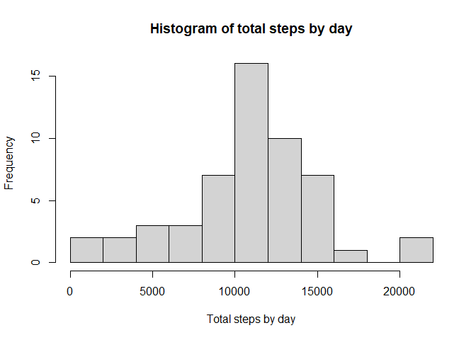
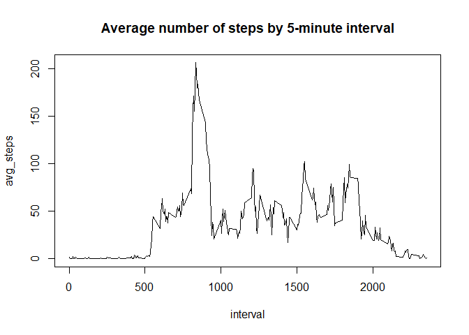
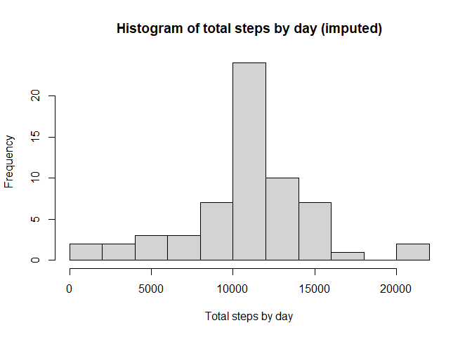

## Loading and preprocessing the data
First of all, we unzip and load the file into a data frame and load the dplyr
package


```r
## Unzipping file
unzip("activity.zip")
## reading file into data frame
activity <- read.csv("activity.csv", header = TRUE)
## loading dplyr package
library(dplyr)
```

Then, we create a new data frame with the total number of steps by day


```r
## calculating total number of steps by day
activity_date <- group_by(activity, date)
act_date_sum <- summarize(activity_date, steps_day = sum(steps))
```

```
## `summarise()` ungrouping output (override with `.groups` argument)
```

## What is mean total number of steps taken per day?

We create a histogram with the total number of steps by day


```r
## histogram of total steps by day
hist(
    act_date_sum$steps_day,
    breaks = 10,
    main = "Histogram of total steps by day",
    xlab = "Total steps by day"
)
```

<!-- -->

We compute the mean and median of steps taken each day


```r
## mean and median of the total number of steps taken by day
summarize(
    act_date_sum,
    mean_steps = mean(steps_day, na.rm = TRUE),
    median_steps = median(steps_day, na.rm = TRUE)
)
```

```
## # A tibble: 1 x 2
##   mean_steps median_steps
##        <dbl>        <int>
## 1     10766.        10765
```

We can see that the median and mean are very close (mean = 10766 and
median = 10765)

## What is the average daily activity pattern?

We create a new table for computing the average number of steps taken in each
interval


```r
## computing average number of steps by interval
activity_int <- group_by(activity, interval)
act_int_avg <-
    summarize(activity_int, avg_steps = mean(steps, na.rm = TRUE))
```

```
## `summarise()` ungrouping output (override with `.groups` argument)
```

we make a time series plot of the 5-minute interval and the average number of 
steps taken, averaged across all days


```r
## plotting of 5-minute interval and average number of steps
with(
    act_int_avg,
    plot(interval, avg_steps, type = "l", main = "Average number of steps by 5-minute interval")
)
```

<!-- -->

we find the 5-minute interval which contains the maximum number of steps


```r
## 5-minute interval with the maximum average number of steps
select(filter(act_int_avg, avg_steps == max(act_int_avg$avg_steps)), interval)
```

```
## # A tibble: 1 x 1
##   interval
##      <int>
## 1      835
```

We see above taht the interval with the maximum number of steps on average is 
the interval labelled with the number 835

## Imputing missing values

We compute the total number of missing values in the dataset


```r
## computing total number of missing values
sum(is.na(activity$steps))
```

```
## [1] 2304
```

We create a new dataset with the missing values filled in:
1. We separate the missing values from the non-missing values
2. We merge the dataset with missing values with the dataset that contains for
   each interval the average through all the days and impute this average for
   the interval in that day
3. we create a new dataset with the non missing values and the missing values
   filled in


```r
## selecting intervals with missing values (the field steps is not selected)
activity_missing <-
    select(filter(activity, is.na(steps) == 1), date, interval)
## selecting intervals with not missing values
activity_not_missing <- filter(activity, is.na(steps) == 0)
## imputing the intervals with missing values with the average of the intervals through all the days
activity_imp <-
    merge(
        activity_missing,
        act_int_avg,
        by.x = "interval",
        by.y = "interval",
        all = TRUE
    )
## Changing the column name avg_steps by steps
activity_imp <- rename(activity_imp, steps = avg_steps)
## putting together the not missing intervals and the imputed missing intervals
activity_imp_all <- rbind(activity_not_missing, activity_imp)
```

we create a new dataset with the total number of steps by day


```r
## calculating total number of steps by day
activity_imp_date <- group_by(activity_imp_all, date)
act_date_imp_sum <-
    summarize(activity_imp_date, steps_day = sum(steps))
```

```
## `summarise()` ungrouping output (override with `.groups` argument)
```

we make a histogram of the total number of steps taken each day


```r
## histogram of total steps by day
hist(
    act_date_imp_sum$steps_day,
    breaks = 10,
    main = "Histogram of total steps by day (imputed)",
    xlab = "Total steps by day"
)
```

<!-- -->

we calculate the mean and median total number of steps taken by day


```r
## mean and median of the total number of steps taken by day
summarize(
    act_date_imp_sum,
    mean_steps = mean(steps_day, na.rm = TRUE),
    median_steps = median(steps_day, na.rm = TRUE)
)
```

```
## # A tibble: 1 x 2
##   mean_steps median_steps
##        <dbl>        <dbl>
## 1     10766.       10766.
```

The mean is the same computed in the beginning and median now is equal to the
mean.

We can see in the new histogram that, the imputing of missing values increase the
frequence of days with steps near the mean of the distribution

## Are there differences in activity patterns between weekdays and weekends?

we create a new factor variable with two levels – “weekday” and “weekend”
indicating whether a given date is a weekday or weekend day


```r
## creating variable type of day (weekend, weekday)
activity_imp_all <-
    mutate(activity_imp_all,
           tday = ifelse(
               weekdays(as.Date(activity$date)) %in% c("sábado", "domingo"),
               "weekend",
               "weekday"
           ))
```

we compute the average by interval through weekdays and weekends


```r
## Calculating average by interval through weekdays and weekend
act_imp_int_week <- group_by(activity_imp_all, interval, tday)
act_imp_int_tday_avg <-
    summarize(act_imp_int_week, avg_steps = mean(steps, na.rm = TRUE))
```

```
## `summarise()` regrouping output by 'interval' (override with `.groups` argument)
```

We make a panel plot containing a time series plot of the 5-minute interval
and the average number of steps taken, averaged across all weekday days or
weekend days


```r
## loading package ggplot2
library(ggplot2)
##
g <- ggplot(aes(x = interval, y = avg_steps), data = act_imp_int_tday_avg)
g <- g + geom_line() + facet_grid(tday ~ .)
g + labs(title = "Evolution of average number of steps (weekdays/weekends) by 5-minute time interval")
```

<!-- -->

